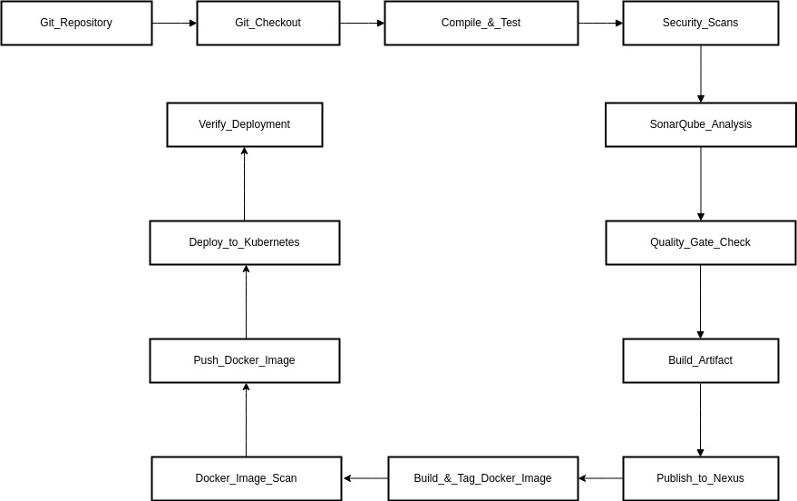

# BoardgameListingWebApp

**Board Game Database Full-Stack Web Application.**

This web application displays lists of board games and their reviews. While anyone can view the board game lists and reviews, they are required to log in to add/edit the board games and their reviews. 'Users' have the authority to add board games to the list and add reviews, while 'managers' have the authority to edit/delete the reviews, in addition to the capabilities of users.
  

## Table of Contents
- [Description](#description)
- [Technologies](#technologies)
- [Features](#features)
- [Images](#images)
- [Authors](#authors)
- [Infrastructure Deployment](#infrastructure-deployment)
- [How to Run](#how-to-run)
- [Lessons Learned](#lessons-learned)

## Description

This application is deployed using the DevOps Tools to create fast delivary, agile enviroment and collaboration Enviroment either on the On-premises sVMware Infrastructure or Over the cloud Infrastructure (AWS).

We have Used Five Virtual Machines On-Premises and Another Edition on AWS Instances with a specific role:

- **master.depi.local**: 
  - k8s master of the Kubernetes Cluster
  - Ansible Control Node
  - Jenkins Master Node (CI/CD)
  - Trivy Code Checker
- **worker1.depi.local**:
  - k8s worker1 node
  - Blackbox exporter
- **worker2.depi.local**:
  - k8s worker1 node
  - Blackbox exporter
- **nexus.depi.local**:
  - Nexus repository for artifacts as a container
  - SonarQube for image testing and scanning as a Container
- **prometheus.depi.local**:
  - Prometheus for monitoring and alerting toolkit for the nodes and the application
  - Grafana for data visualization and monitoring platform

- **On-premises IP Range**
  -192.168.10.15*/24

- **On-premises Ready Made VM Hyperlink**
  -<URL>
  -Username: un
  -Password: P@ssw0rd

- **On Cloud AWS Instances Follow the HyperLink**
  -https://github.com/AhmedWaleedAhmed/DevOpsPipelineMastery

## Technologies

- On-premises VMware environment
- Amazon Web Services (EC2)
- Terraform
- Ansible
- Jenkins
- Trivy
- Sonarqube
- Nexus
- K8s
- Prometheus
- Grafana
- Java, Spring Boot, Spring MVC, Spring Security
- Thymeleaf & Thymeleaf Fragments
- HTML5, CSS, JavaScript, Twitter Bootstrap
- JDBC
- H2 Database Engine (In-memory)
- JUnit test framework
- Maven

## Features

- **Full-Stack Application**
- UI components created with Thymeleaf and styled with Twitter Bootstrap
- Authentication and authorization using Spring Security:
  - Authentication by allowing the users to authenticate with a username and password.
  - Authorization by granting different permissions based on roles (non-members, users, and managers).
- Different user roles with varying permissions:
  - **Non-members**: Can only view the board game lists and reviews.
  - **Users**: Can add board games and write reviews.
  - **Managers**: Can edit and delete reviews.
- Deployed the application on Virtual Machines On-Premises and AWS EC2
- Unit testing using JUnit test framework
- Spring MVC best practices to segregate views, controllers, and database packages
- JDBC for database connectivity and interaction
- CRUD (Create, Read, Update, Delete) operations for managing data in the database
- Schema.sql file to customize the schema and input initial data
- Thymeleaf Fragments to reduce redundancy of repeating HTML elements (head, footer, navigation)

## Images




## Authors

| Name               | Role                | Contact                     |
|--------------------|---------------------|-----------------------------|
| Tarek EL Baz       | Project Contributor | [tarekelbaz@gmail.com](mailto:tarekelbaz@gmail.com) |
| Ahmed AbdelRahman  | Project Contributor | [ahmedabdelrhman443@gmail.com](mailto:ahmedabdelrhman443@gmail.com) |
| Ahmed Waleed       | Project Contributor | [ahmedwaleedahmed.amin@gmail.com](mailto:ahmedwaleedahmed.amin@gmail.com) |
| Ibrahim El Araby   | Project Contributor | [ibrahim.expertmideast@gmail.com](mailto:ibrahim.expertmideast@gmail.com) |
| Nahla Samy         | Project Contributor | [nahlasas1712@gmail.com](mailto:nahlasas1712@gmail.com) |

## Infrastructure Deployment

- **Download the VM**: Download the VM then use VMwareWorkstation to run it 
- **Create four Copies**: create four copies of the vms but change the name of the virtual machines and the IP Configuration, be notices when you create the four VM use move option while power on the VM.
- **Login to the user**: Login to the user account then use the first script 
1. 1-init.sh: this script is used to change the root password, create user account devops-user and create privilages for this user account with sudo on the 5 machines

- **Ansible Configuration on Master Node**
2. 2-ansible.sh: this script is used to on the master node only to act as controller to the other VMs
3. Edit the /etc/ansible/hosts file with this configuration:
```bash
  sudo vim /etc/ansible/hosts
```

[masters]
master.depi.local ansible_host=192.168.10.150 ansible_user=devops-user ansible_connection=local

[workers]
worker1.depi.local ansible_host=192.168.10.151 ansible_user=devops-user
worker2.depi.local ansible_host=192.168.10.152 ansible_user=devops-user

[nexus]
nexus.depi.local   ansible_host=192.168.10.153 ansible_user=devops-user

[monitor]
prometheus.depi.local   ansible_host=192.168.10.154 ansible_user=devops-user

- **Create SSH keys on Master Node**
4. create the SSH Keys using ssh-keygen with encryption and hashing algorithm ed25519:
```bash
  ssh-keygen -t ed25519
  sudo vim /etc/hosts
192.168.10.150  master.depi.local   master
192.168.10.151  worker1.depi.local  worker1
192.168.10.152  worker2.depi.local  worker2
192.168.10.153  nexus.depi.local    nexus
192.168.10.154  prometheus.depi.local prometheus
  ssh-copy-id -i /home/devops-user/.ssh/id_ed25519.pub devops-user@worker1.depi.local
  ssh-copy-id -i /home/devops-user/.ssh/id_ed25519.pub devops-user@worker2.depi.local
  ssh-copy-id -i /home/devops-user/.ssh/id_ed25519.pub devops-user@nexus.depi.local
  ssh-copy-id -i /home/devops-user/.ssh/id_ed25519.pub devops-user@prometheus.depi.local
  ansible -m all ping
```
- **Install Jenkins in Master Node**
5. use ansible-playbook to install jenkins on the master node 3-jenkins.yaml
  ```bash
  ansible-playbook 3-jenkins.yaml
  ```
- **Install Trivy on the Master Node**
6. use ansible-playbook to install trivy on the master node 4-trivy_config.yaml
  ```bash
  ansible-playbook 4-trivy_config.yaml
  ```
- **Install Nexus and Sonar as containers on the Nexus Node**
7. Install Nexus and Sonar as containers using the Master Node which contains ansible control node to deploy nexus and sonar containers using docker compose:
  ```bash
  ansible-playbook 5-nexus-sonar-docker-yaml/playbook.yml
  ```

- **Install prometheus and grafana as containers on the Prometheus Node**
8. Install prometheus and grafana as containers using the Master Node which contains ansible control node to deploy prometheus and grafana containers using docker compose:
  ```bash
  ansible-playbook 6-Prometheus and grafana/prometheus-grafana-docker.yml
  ```

- **Install K8s on the Master Node**
9. Install k8s on the Master Node using ansible-playbook to install master nodes and worker nodes:
  ```bash
  ansible-playbook 7-K8s/k8s_setup.yml
  ```
NB: If you restarted the virtual machines that have the k8s cluster, please run the script 8-k8s_restart on the master node then the worker nodes.

10. **Open Nexus:**
```bash
http://<your_nexus_server_IP>:8081
```
11. **login on Nexus:**
```bash
username: admin
password: get the password by ssh to your server and get the initial password through => `docker exec -it nexus cat /nexus-data/admin.password`
```

12. **Open SonarQube:**
```bash
http://<your_nexus_server_IP>:9000
```
13. **login on SonarQube:**
```bash
username: admin
password: P@ssw0rd
```

- **Login to jenkins**
14. login to jenkins, get the password from /var/lib/jenkins/secret.key then change the password from the UI
```bash
sudo cat /var/lib/jenkins/secret.key 
```

15. **Creating a Jenkins API Token:**
  * Log in to your Jenkins instance.
  * Click on your username in the top right corner of the dashboard.
  * Select **Configure** from the dropdown menu.
  * Scroll down to the **API Token** section.
  * Click on **Add new Token** or **Generate** to create a new API token.
  * Copy the generated token and store it securely.
16. **Creating a SonarQube Token:**
  * Log in to your SonarQube instance.
  * Navigate to **Administration** in the main menu.
  * Select **Security** from the submenu.
  * Click on **Users**.
  * Find your user account and click on it.
  * In the **Tokens** section, click on **Generate** to create a new token.
  * Copy the generated token and store it securely.
17 **Prepare your Nexus Username.**
18. **Prepare your Nexus Password.**
19. **Creating a Docker Hub Personal Access Token:**
  * Log in to your Docker Hub account.
  * Click on your username in the top right corner.
  * Select **Account Settings** from the dropdown menu.
  * Navigate to the **Security** tab.
  * Under the **Personal access tokens** section, click on **Create Access Token**.
  * Enter a descriptive name for your token and select the **Read & Write** scope.
  * Click **Generate** to create the token.
  * Copy the generated token and store it securely, as it will not be displayed again.
20. **Creating a SonarQube Webhook:**
  * Log in to your SonarQube instance.
  * Navigate to **Administration** in the main menu.
  * Select **Configuration** from the submenu.
  * Click on **Webhooks**.
  * Click on the **Create** button.
  * Enter a name for your webhook (e.g., "Jenkins Webhook").
  * In the **URL** field, enter the following URL: `http://<Jenkins-IP>:8080/sonarqube-webhook/`
  * Click **Save** to create the webhook.
21. **Get Maven Releases and Snapshots URLs from Nexus.**
22. **Update the pom.xml file:**
```
code complete_CICD_project/boardgame/pom.xml
```
```
 <distributionManagement>
        <repository>
            <id>maven-releases</id>
            <url>http://<your_nexus_server_IP>:8081/repository/maven-releases/</url>
        </repository>
        <snapshotRepository>
            <id>maven-snapshots</id>
            <url>http://<your_nexus_server_IP>:8081/repository/maven-snapshots/</url>
        </snapshotRepository>
    </distributionManagement>
```

30. **Check that all the plugins were installed from the UI.**
31. **Check that all the tools were installed in the tools section.**
32. **Check that the managed configuration file is added successfully.**
33. **Check that the credentials were added.**
34. **Check on the system (sonar)**
35. **Copy the pipeline from the repository and update the created pipeline with it:**
```
complete_CICD_project/Jenkinsfile
```

36. **Run the playbook to set up Monitoring:**
```bash
  ansible-playbook -i inventory.yml playbooks/monitoring_setup.yml
```
37. **Update the `promethues.yml` file with your IPs.**
38. **Add prometheus as a datassource.**
39. **Create the dashboard**
40. **Run the pipeline.**

## How to Run

1. To use initial user data, use the following credentials:
   - **username**: bugs | **password**: bunny (user role)
   - **username**: daffy | **password**: duck (manager role)
2. You can also sign up as a new user and customize your role to explore the application! 😊

## Lessons Learned

1-	How to use Containerd with k8s:
There are two ways: By using nerdctl or by using docker-cli with Containerd engine and we chose the second way to use Docker commands in the pipeline.

2-	How to deploy artifacts to Nexus using Maven:
We learned how to deploy artifacts using Maven and to edit the POM.xml and add general settings file to Jenkins and configure them to deploy the artifacts to our Nexus server.

3-	How to make SonarQube after checking the quality gate inform Jenkins to continue the pipeline
We learned how to make a SonarQube webhook for Jenkins to inform Jenkins the code passed the quality gate or not.
